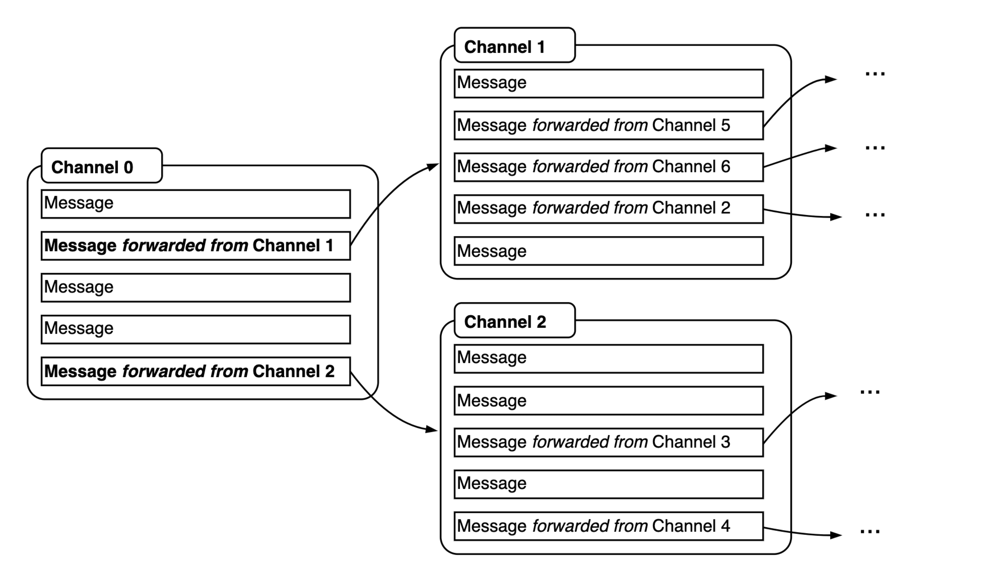

# telegram-scraper

This repository is a pointer for the Telegram scraper that accompanies the paper "A Computational Analysis of Telegram's Narrative Affodances".

The scraper can be used to collect data from publically available Telegram channels that can be previewed from a browser. To this end, the script implements the "snowballing" method for collecting Telegram data discussed in the paper. Starting from a given seed channel, the scraper will identify related channels based on forwarded messages, and will continue to do so until a specified scraper depth has been achieved. Users have the options of collecting images and videos in addition to message texts. 

---
## 1 Request access to Python scripts

Although the scraper can only be used to collect Telegram data that are publically previewable from a browser (also by users who do not have a Telegram account), it cannot be assumed that the gathered data are openly available for distribution in a different (in the present case, scientific) context. By extension, the same holds for the instruments through which these data can be collected. Therefore, the Python scripts for scraping the data can only be shared upon request. Each request will be considered individually and code will be shared with trusted partners.

In order to request access, please reach out via [email](mailto:tom.willaert@vub.be). 

---

## 2 Setting up the Python environment

After access has been granted to the Python scripts, users are advised to configure the proper Python environment in order to ensure that all required dependencies for running the scraper are installed.

Anaconda is one way to get up and running with Python environments. However, the full Anaconda toolkit installs 1500 Python packages and takes up 3GB of disk space. A good alternative, therefore, is Miniconda. Miniconda will only install the bare minimum to run Python. It is then up to you to manually install the packages that you _really_ need.

Download Miniconda from [this website](https://docs.conda.io/en/latest/miniconda.html) and follow the installation instructions. If you are prompted to add Miniconda to your `.bash_profile` or `.zshrc`, accept. For the changes to take effect and use `conda` from the command line, you must restart the Terminal. At the time of writing, the Miniconda website suggests to install Miniconda with Python 3.9.

The `environment.yml` file in the scraper repository makes it easy to recreate the `telegram-scraper` conda environment that was used to develop this project. This file lists all necessary packages and their version numbers. You can use the Makefile to setup this environment.

1. To recreate the `telegram-scraper` conda environment that was used to develop this project, run:
   - `make create_environment`
2. If the environment was successfully created, you can activate it by running
   - `conda activate telegram-scraper`
   - You should see the prompt of your Terminal change from `(base)` to `(telegram-scraper)`.

---

## 3 Running the scraper from the command line

The scraper can be run from the command line. First, activate the required environment following the procedure outlined above. Then, in the telegram-scraper folder, run the following command to start scraping: 

`python telegram_scraper_terminal_multiprocess.py -p -d -s`

whereby: 

`-p` = the path for storing the outputs. 

`-d` = the required scraper depth. E.g. a depth of 0 entails only the seed will be scraped, a depth of 1 the seed and all channels linked to the seed through forwarded messages, and so on. 

`-s` = a list of urls for public Telegram channels to us as the seed for the scraper.   

To include images or videos, the 'images' and 'videos' parameters in the snowball_channel_data function on line 572 of the script should be set to 'True' (these default to 'False'). 

---
## 4 Contact

Questions or remarks can be sent via [email](mailto:tom.willaert@vub.be). 